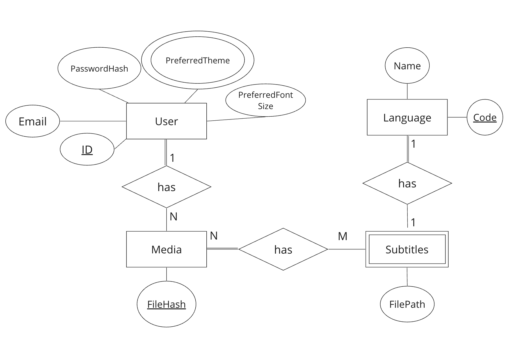

# WaSubby / Group 22


## Requirements

- [Client Requirements](./client/README.md#Requirements)
- [Server Requirements](./server/README.md#Requirements)
  - **Make sure to install `whisper-ctranslate2`**!

## Known limitations

- Sometimes, especially when using the "tiny" whisper model (`npm run fast-dev`), the subtitles have some issues, e.g. some words are very repeated multiple times.
  This is a common issue with whisper
- When showing multiple subtitle tracks, the order of the subtitles might switch around.
  This is because we're using the browser `<video>`, which natively doesn't support showing multiple subtitles at all,
  so we don't have any control over this.
  - Alternatively, we could have rendered the subtitles on our own,
    but this would add more complexity (working with VTT objects,
    getting every single subtitle line and rendering it on our own, etc.),
    which we decided is out-of-scope.
- Some common media types aren't supported, because either the browser
  can't display them (missing codec), or whisper doesn't support it.
  If in doubt, just convert it to mp4 (or mp3 for audio) and use that.
- When using an audio file as media, the video player will still be shown, but it will be empty (so only audio is playing).
  This is because the HTML `<audio>` element doesn't support showing subtitle text tracks, so using a `<video>` is a workaround for that.

## Getting started

```bash
# Clone repository
git clone git@git.chalmers.se:courses/dit342/group-00-web.git

# Change into the directory
cd group-22-web

# Setup backend
cd server && npm install
# delete all data (optional)
npm run clean

# start server in dev mode
npm run dev
# or
npm run fast-dev # uses tiny whisper model

# Setup frontend
cd client && npm install
npm run serve
```

You also need to have whisper-ctranslate2 installed. (see [backend readme](./server/README.md))

> Check out the detailed instructions for [backend](./server/README.md) and [frontend](./client/README.md).

## Project Structure

| File                                                 | Purpose                           | What you do?                              |
| ---------------------------------------------------- | --------------------------------- | ----------------------------------------- |
| `server/`                                            | Backend server code               | All your server code                      |
| [server/README.md](server/README.md)                 | Everything about the server       | **READ ME** carefully!                    |
| `client/`                                            | Frontend client code              | All your client code                      |
| [client/README.md](client/README.md)                 | Everything about the client       | **READ ME** carefully!                    |
| [docs/DEPLOYMENT.md](docs/DEPLOYMENT.md)             | Free online production deployment | Deploy your app online in production mode |
| [docs/LOCAL_DEPLOYMENT.md](docs/LOCAL_DEPLOYMENT.md) | Local production deployment       | Deploy your app local in production mode  |

## System Definition (MS0)

### Purpose

The system - called WaSubby - will **transcribe video and audio files** from around 100 languages and translate them into English, too. WaSubby will also give users the ability to watch a video or listen to an audio file while reading subtitles in both English and the language of the source file simultaneously, to aid language-learning.

### Pages

- **Home Page**
  - Landing Page, introduces the service
- **User Account Page**
  - Users can set their favorite theme (The theme is based on the language) and preferred font size.
- **Signup Page, Login Page**
- **Media Player Page**
  - Transcribes and shows media (video or audio files)
  - If the subtitles for the source language + translation are already generated (stored on the server), the video starts playing with those, otherwise, the user gets feedback (e.g. spinner, progress bar) that the subtitles are being generated

### Entity-Relationship (ER) Diagram



## Teaser (MS3)


